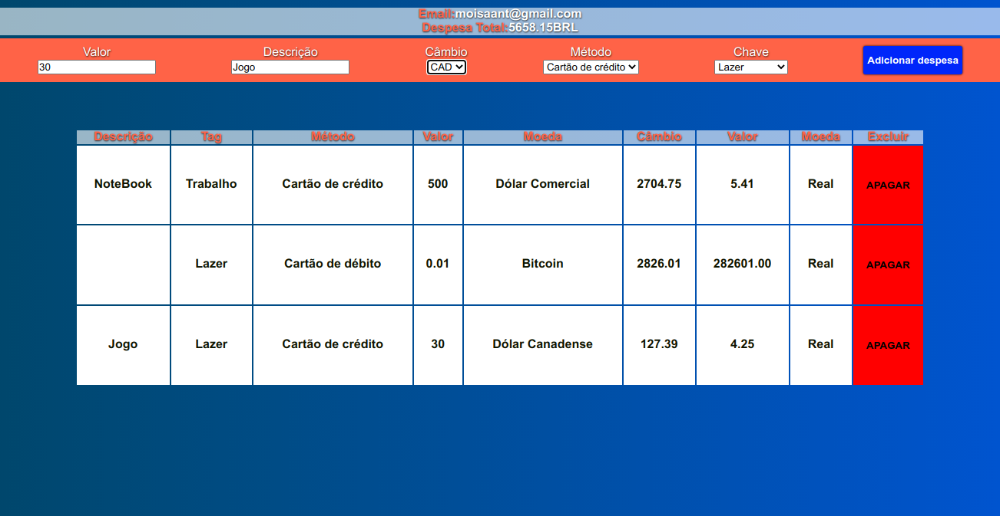

# Wallet

### Acesso
***Atenção aplicação não foi portada para dispositivos móveis**

***Para utilizar o app acesse: https://wallet.netlify.app***

Wallet é uma aplicação web que converte seus gastos com moedas estrangeiras para o real.

---

## Projeto proposto pela Trybe

Projeto proposto pela Trybe para por em prática os conhecimentos em Redux, onde foi pedido que o estado fosse gerenciado pelo Redux, e fosse consumida uma API para ter acesso as informações dos cambios.

---

## Mão na massa

Neste projeto foi usado class component com Redux para gerenciar os estados, Redux é um framework em que você consegue gerenciar os estados da sua aplicação de uma forma bem organizada, ideal para aplicações onde precisa gerenciar muitos estados evitando prop-drilling. Optei por utilizar o styled-componenet para estilizar o projeto que é um framework para fazer CSS-in-JS, onde você pode criar componentes estilizados e importar na sua página, ele também evita problemas como modularidade e não precisa se preocupar com nomes de classes.
Neste Projeto teve uma API consumida para ter acesso a informações dos cambios.

---